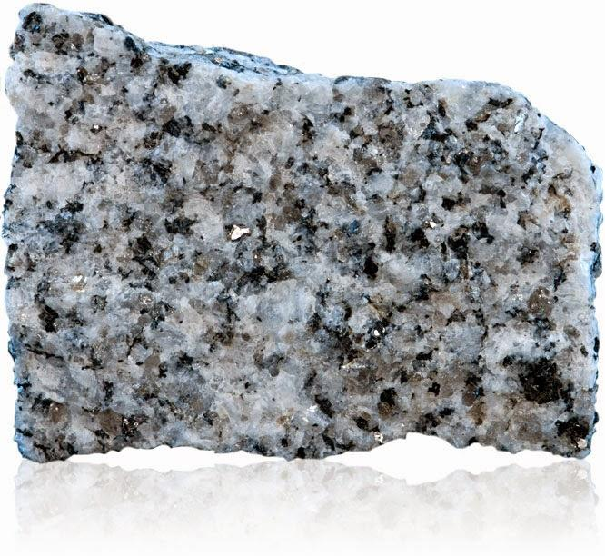
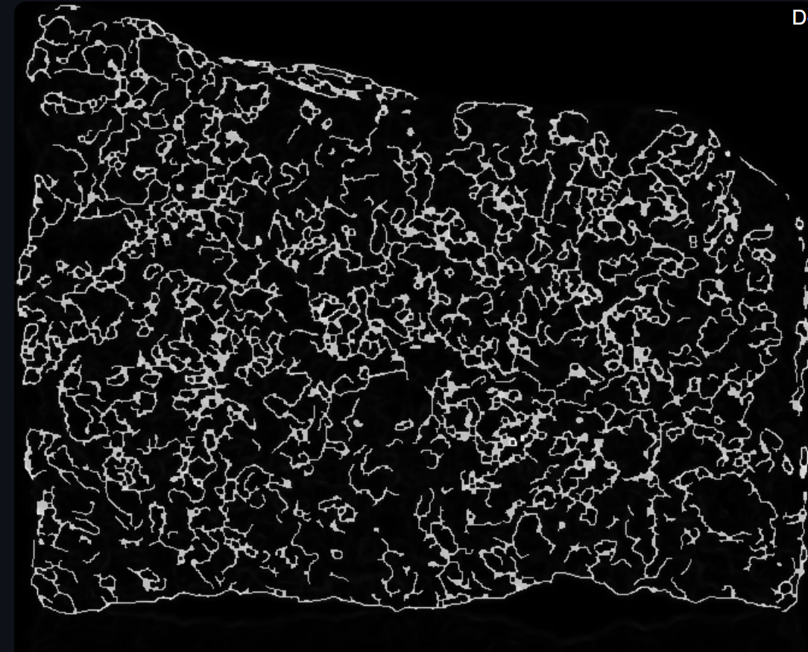
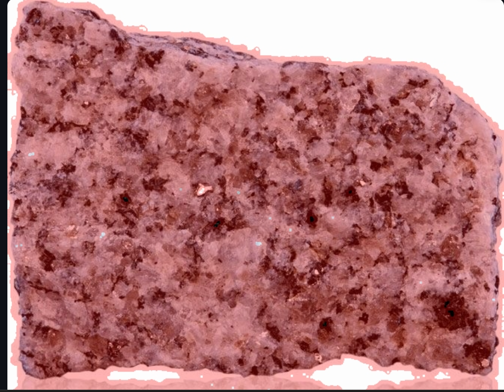
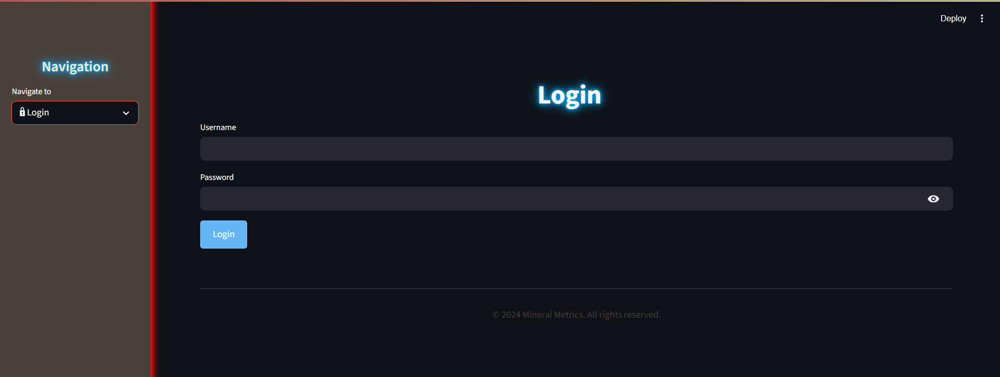
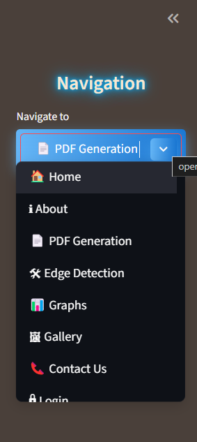
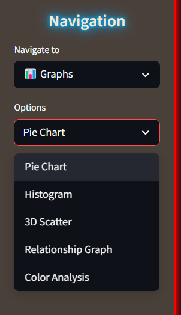
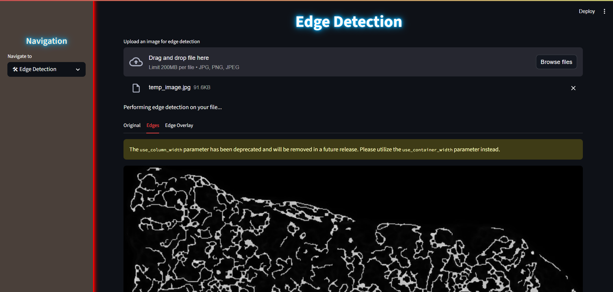
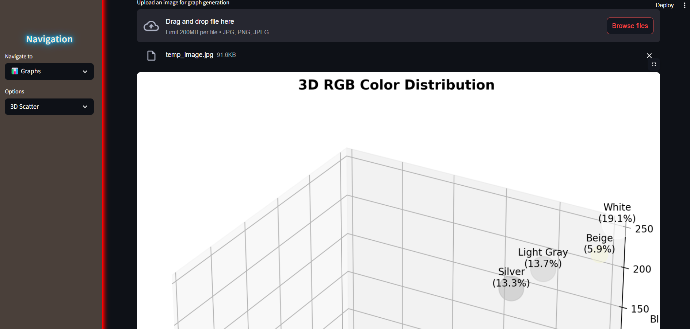

# MineralMetrics

> 🏆 **Hackathon Winning Project!**  
> Winner at Codeutsava 8.0 among 2800+ teams.

MineralMetrics is a powerful web application designed for the analysis of rock images. The project takes a rock image, detects its edges and color composition, and generates insightful visualizations and a downloadable PDF report.

---

## 🚀 How to Run Locally

1. **Clone the Repository**
   ```bash
   git clone https://github.com/analyticssingh0288/MineralMetrics.git
   cd MineralMetrics
   ```

2. **Create a Virtual Environment**
   ```bash
   python -m venv venv
   source venv/bin/activate  # On Windows: venv\Scripts\activate
   ```

3. **Install Dependencies**
   ```bash
   pip install -r requirements.txt
   ```

4. **Run the Application**
   ```bash
   python app.py
   ```
   The web app will be available at `http://localhost:5000` (or as printed out by Flask).

---

## 🛠️ Project Workflow

1. **Input Image**  
   Upload any rock image (for example, `test_image.png`).
    
2. **Edge Detection**  
   The app detects edges in the uploaded image.  
   *Example Output:*  
   

3. **Edge Overlay**  
   The detected edges are overlaid on the original image for better visualization.  
   *Example Output:*  
   

4. **Color Analysis**  
   The app analyzes the color composition of the rock and generates bar charts and statistics.

5. **PDF Report Generation**  
   All findings (edge maps, color bar charts, overlays, and analysis) are compiled into a downloadable PDF report.  
   *Example Output:*  
   

---

## 🌐 Current UI Showcase

Below are the current UI snapshots. Each section is titled by the image's file name:

### Login Page



### Navigation Bar 



### Navigation Bar 


### Edge Detection


### Graph



---

## 💡 Final Thoughts

MineralMetrics brings advanced mineral analysis to everyone’s fingertips. Whether you’re a geologist, student, or enthusiast, this tool empowers you with easy-to-understand visualizations and reports. Proudly built as a hackathon-winning solution, we hope it inspires your curiosity and helps in your explorations!

**Happy Analyzing! 🚀**
